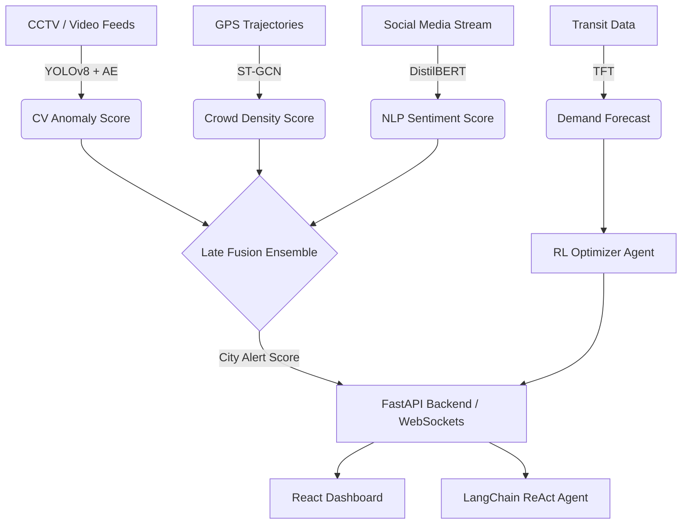

# Methodology & Architecture

## System Architecture Diagram

## Model Details
1. **ST-GCN**: 2 Graph Convolution layers followed by an LSTM. Nodes = 500, Hidden Params = ~2.5M.
2. **Temporal Fusion Transformer**: Multi-head attention (4 heads) for multi-horizon forecasting (1h, 6h, 24h).
3. **Computer Vision**: YOLOv8 (nano) for real-time tracking (ByteTrack). Bounding box sequences fed into a Dense Autoencoder for reconstruction error (anomaly score).
4. **NLP**: DistilBERT fine-tuned on disaster response tweets.
5. **RL Optimizer**: DQN using `stable-baselines3` simulating transit dispatch scenarios.
